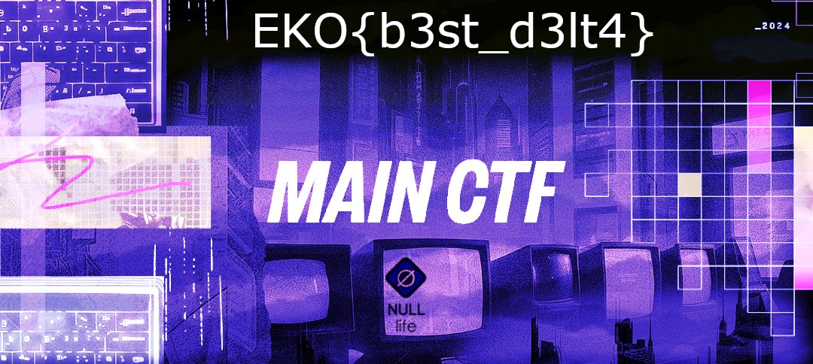

# Delta
Liam Reidy

For this challenge we are given and image and a binary file.


Investigating the binary, it is apparently a `VCDIFF` binary file:

```
$ file flag.bin
flag.bin: VCDIFF binary diff
```

VCDIFF is an encoding method that stores the difference between 2 files. Decoding it wasn't difficult because of it's complexity, but rather due to its obscurity. I couldn't get Google's `open-vcdiff` tool to work, but I found [xdelta](https://github.com/jmacd/xdelta) which implements it.

Using the tool on the two files produced a new image with the flag displayed in it.

```
xdelta3 -d -s null.bmp flag.bin newfile
```



`EKO{b3st_d3lt4}`