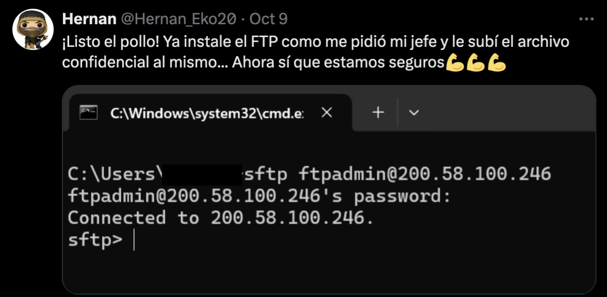
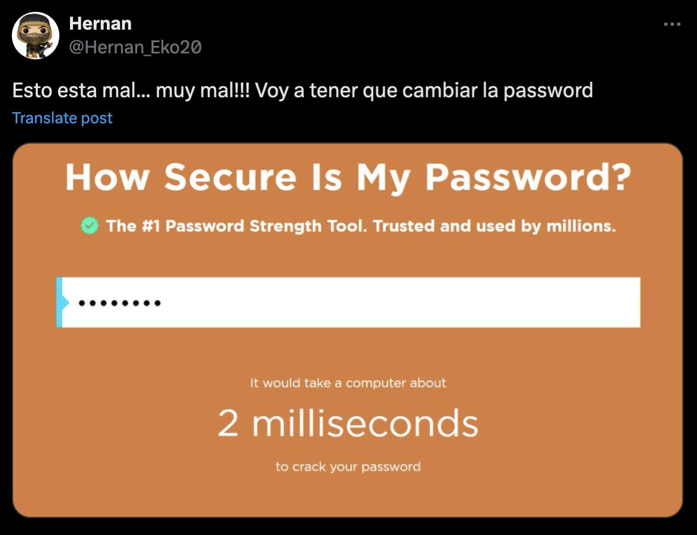
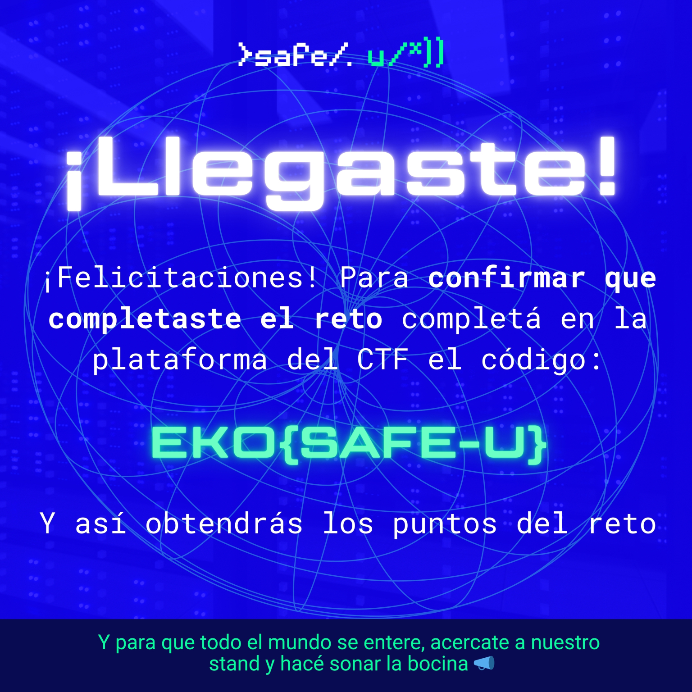

# Safe-U
Liam Reidy

This challenge started by directing us to a twitter account where a screenshot of a sftp login was posted.



On the same twitter account, this user posted their password entered into the password strength checker website, telling us it was
1. easily guessable
2. **8 characters long**



An even earlier tweet had the user's birthday

```
Acabo de darme cuenta que ya pasaron 201 días de mi último cumpleaños... 
solo faltan 165 para mis 30 ¡A disfrutar lo que restan de mis 29!🥳🥳🥳
```

With some simple translation and math, we find that the user's birthday is `March 22nd 1995`. As 8 characters, that could be written as `22031995`, and sure enough that is the stfp server's password.

In the server, there was a zip file in a hidden directory.

```
Connected to 200.58.100.246.
sftp> ls
sftp> ls -a
.         ..        .privado
sftp> cd .privado
sftp> ls
flag.zip
```

The zip was password protected, so I brute forced the hash with `zip2john` and `john`.

```
zip2john Downloads/flag.zip > hash.txt

john hash.txt
Warning: detected hash type "ZIP", but the string is also recognized as "ZIP-opencl"
Use the "--format=ZIP-opencl" option to force loading these as that type instead
Using default input encoding: UTF-8
Loaded 1 password hash (ZIP, WinZip [PBKDF2-SHA1 128/128 ASIMD 4x])
Proceeding with single, rules:Single
Press 'q' or Ctrl-C to abort, almost any other key for status
Warning: Only 5 candidates buffered for the current salt, minimum 8 needed for performance.
Warning: Only 3 candidates buffered for the current salt, minimum 8 needed for performance.
Warning: Only 5 candidates buffered for the current salt, minimum 8 needed for performance.
Warning: Only 4 candidates buffered for the current salt, minimum 8 needed for performance.
Almost done: Processing the remaining buffered candidate passwords, if any.
Warning: Only 7 candidates buffered for the current salt, minimum 8 needed for performance.
Proceeding with wordlist:/opt/homebrew/Cellar/john-jumbo/1.9.0_1/share/john/password.lst, rules:Wordlist
november         (flag.zip/rockyou.jpg)
1g 0:00:00:02 DONE 2/3 (2024-11-13 18:17) 0.3436g/s 13940p/s 13940c/s 13940C/s ilovegod..celtic
Use the "--show" option to display all of the cracked passwords reliably
Session completed
```

As seen above, `november` is the password to the zip, and the zip contains the file `rockyou.jpg`, which displays the flag:



It was actually quite surprising that the flag was just the name of the challenge...

`EKO{SAFE-U}`