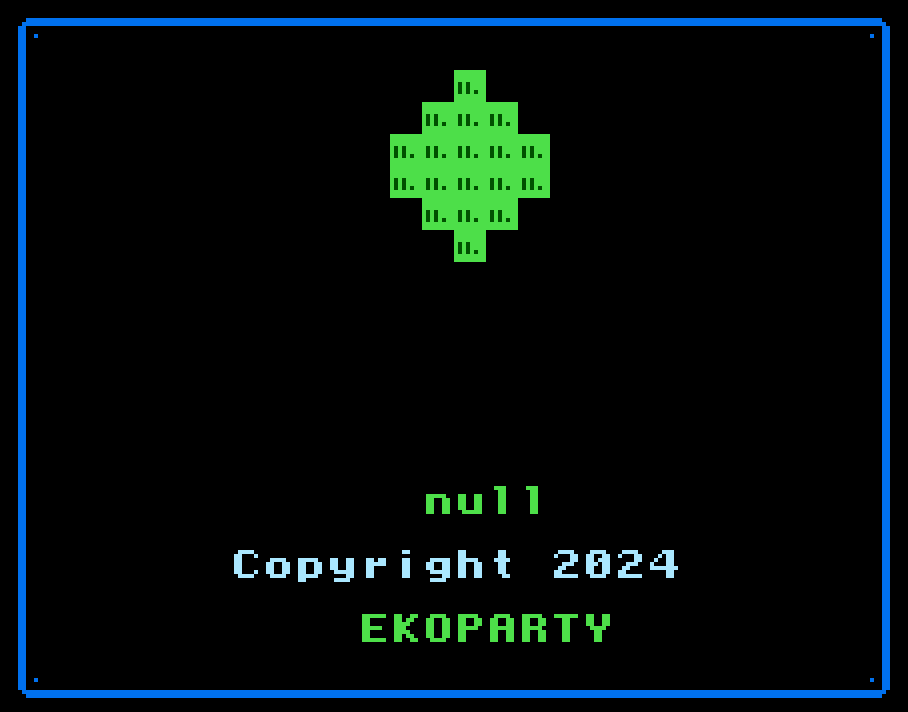
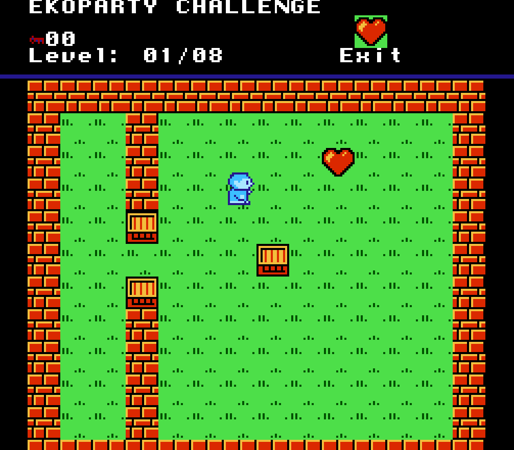
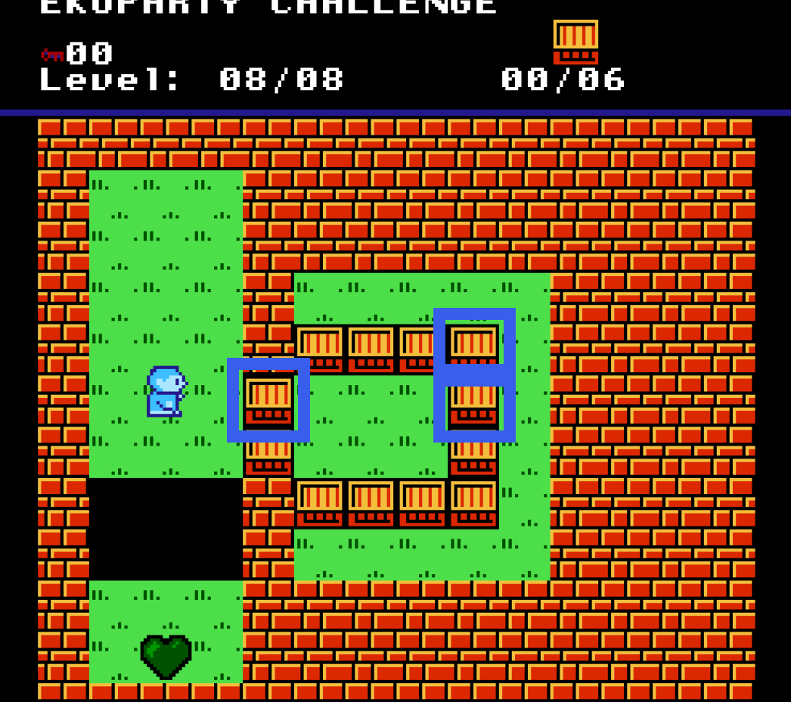
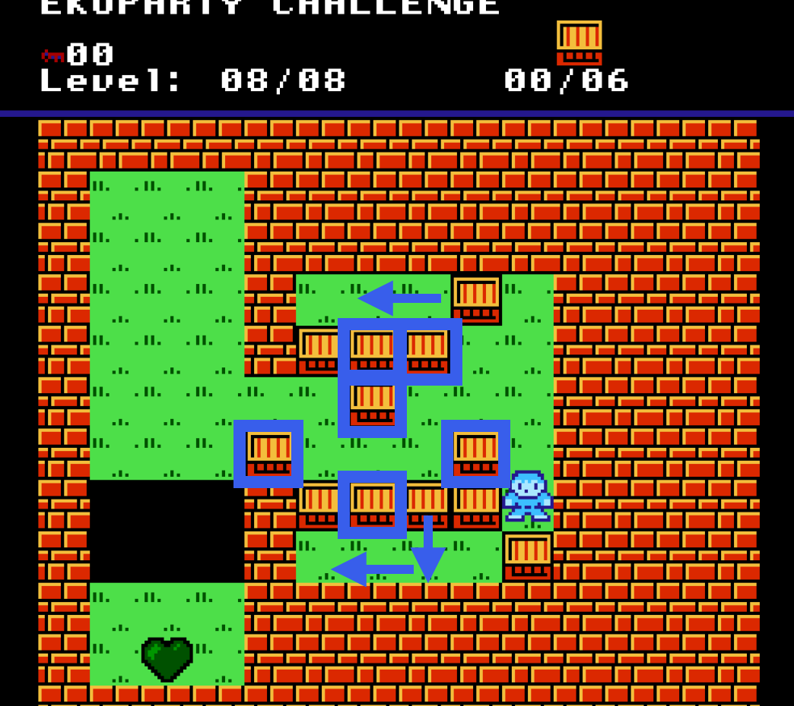
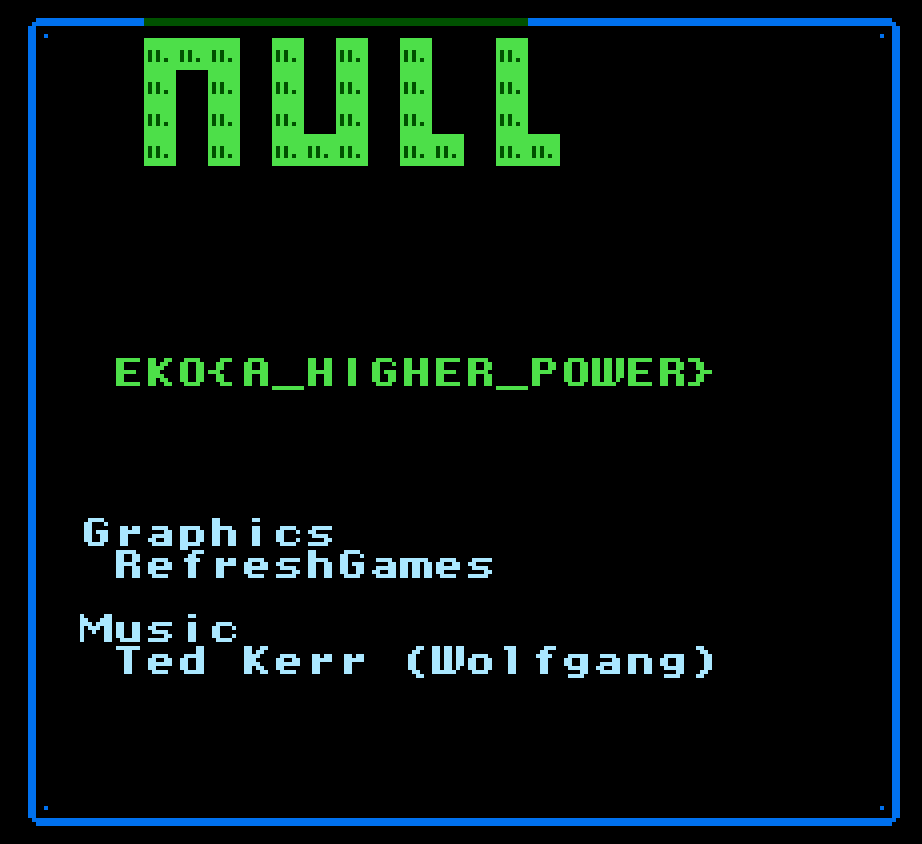

# Toretto
Liam Reidy

In this challenge we were given a zip file with a binary in it.

```
$ file toretto.bin
toretto.bin: NES ROM image (iNES): 8x16k PRG, 0x8k CHR [V-mirror]
```

After a little research, I downloaded `FCEUX` to emulate the game.




The game was fairly straightforward up until the last level. The goal was to collect all coins in each level, and fill any holes with boxes. There were a couple different ways you could soft lock yourself, but the `B` button on an NES controller was mapped to an undo function.



The strategy on the last level was to start by moving one of the "entry" blocks, then moving the block in the top right and the one right below it. Moving those up and down opened up more of a pathway. By pushing the top block and a new one behind the other ones and past them, I was able to get to the other side of at least 6 blocks, and could push them towards the holes. Shown below are the directions you need to move certain blocks, and the highlighted boxes are the ones I used to fill the holes.



Completing this final level reveals the flag.



`EKO{A_HIGHER_POWER}`
