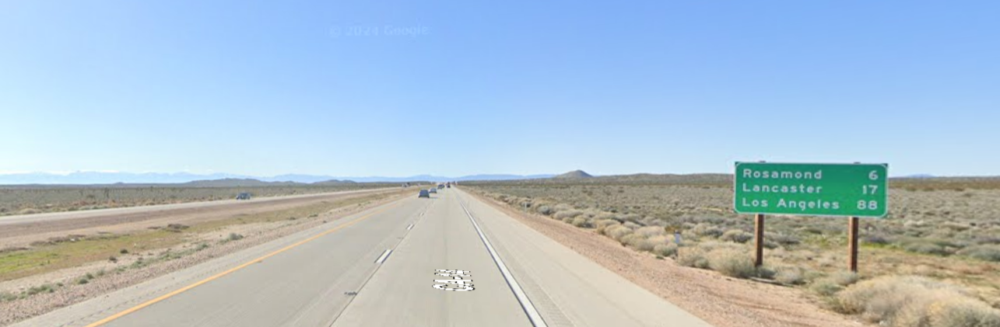

# California dreamin'
Liam Reidy

**Instructions:** The Professor has uncovered a critical piece of evidence: a dashcam photo retrieved from a hostile subject’s car, suspected of planning an infiltration at a nearby military installation. Your task is to utilize OSINT skills to stop this threat before it's too late. Analyze the **dashcam** **image** to determine the exact coordinates where it was taken. Identify the **nearest military installation** to this location. Find the distance **by** **road** (in miles) from the exact coordinates of the dashcam image to the military installation. Round off the mile count to the nearest whole number. Flag format:Q UESTCON{<Name of airforce base>-<rounded off mile count>} The name should be one word and lowercase

Since we're driving towards Los Angeles, Lancaster, and Rosamond, we're going south. 

CA 14 goes north and south, and it looks like you can also make out it's name on the road.

I used this website (https://www.todaysmilitary.com/ways-to-serve/bases-around-world) to find the closes military base, that being `Edwards Air Force Base`

I went in streetview about 6 miles above Rosamond and went south until I found the sign. I took the coordinates from the url in google maps, and asked for directions from the air force base to that spot, giving me 23 miles. Following the formatting instructions, the flag became `QUESTCON{edwards-23}`

