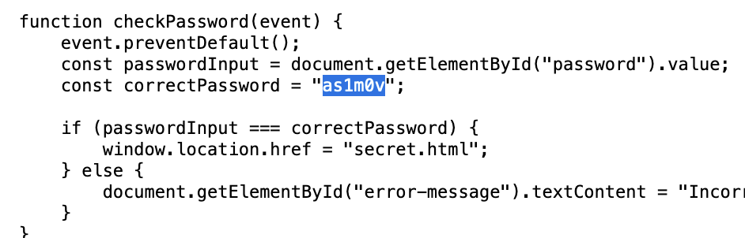
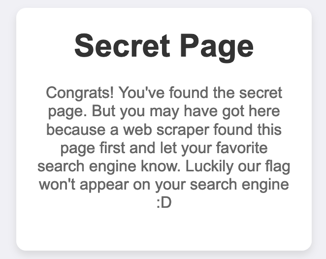

# iRobots-Solution
Liam Reidy

**Instructions:** Can you get to the flag? https://usc-irobots.chals.io

Visiting the site. There is only a box that checks for a password. Viewing the page's source, we see that this is done in the browser and not server-side. The password is viewable in plaintext.



Entering the password, we are taken to a new page. This secret page does not have anything in it's source, and hints at the secret being in a place web-crawlers will be unable to reach. That tells me that the flag's url may be exposed by the `robots.txt` file.



Visiting the `/robots.txt` file, we see that the following page is blocked:

```
User-agent: *
Disallow: /hidden/flag.txt
```

Sure enough, visiting that site reveals the flag.

```
CYBORG{ro...n}
```