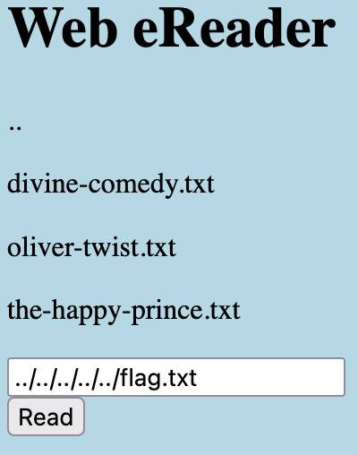

# Forbidden Paths
Liam Reidy

**Instructions:** Can you get the flag? We know that the website files live in /usr/share/nginx/html/ and the flag is at /flag.txt but the website is filtering absolute file paths. Can you get past the filter to read the flag? Here's the website.

I feel like I'm being mocked. How is this considered `Medium` Difficulty?

Simple directory traversal using `..` is all we need here.
