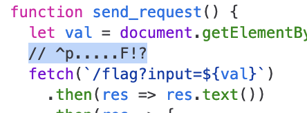

# MathTheRegex
Liam Reidy

**Instructions:** How about trying to match a regular expression

This one is as simple as it sounds. Commented in the `send_request` function is the regex we have to match:

Using https://regex101.com/, I found that the string `picoCTF` matches the regex. Inputting this into the website returned the flag.
