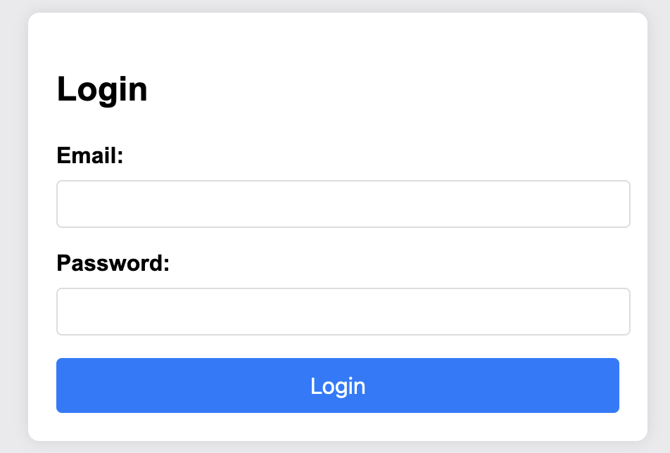
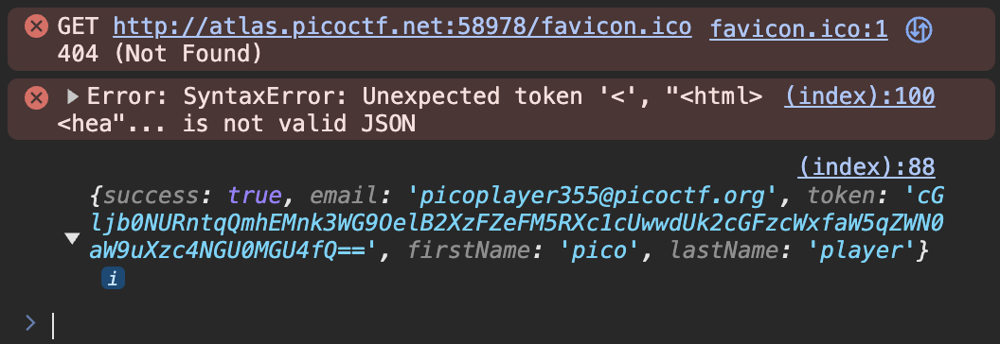

# No Sql Injection
Liam Reidy

**Instructions:** Can you try to get access to this website to get the flag? You can download the source here. The website is running here. Can you log in?



In unsuprising news, a regular SQL injection won't work for this challenge. However, we're still using an injection attack. Turns out, `NoSQL` is a database that exists, so I started researching injection attacks against it. I came across this site (https://portswigger.net/web-security/nosql-injection) from PortSwigger. How appropriate, I suspected I would be using Burp Suite for this challenge anyway.

On the vulnerable site itself, we login by sending an HTTP request with this snippet of code at the bottom:

```json
{
    "email":"",
    "password":""
}
```

From PortSwigger, I suspected this segment of code might work the best: `$ne - Matches all values that are not equal to a specified value.`

By using the `$ne` operator, we could compare whatever we want to whatever we want, thus making the condition true. Here's the payload I wrote: `{"$ne":"q"}`

Inserting it into the HTTP request using Burp Suite, we have:
```json
{
    "email":"{\"$ne\":\"q\"}",
    "password":"{\"$ne\":\"q\"}"
}
```

Sure enough, the response had the key in base64!



Translating that into plaintext, we get the flag.

`picoCTF{jBhD2y7...84e40e8}`

Sources:
https://portswigger.net/web-security/nosql-injection
