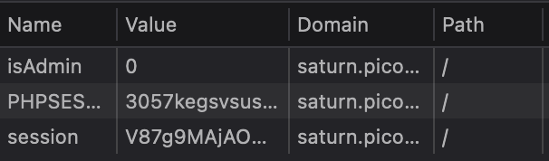

# Power Cookie
Liam Reidy

**Instructions:** Can you get the flag? Go to this website and see what you can discover.

On the start page, there is a button that offers you to login as the guest. Here's the function that does it:

```js
function continueAsGuest()
{
  window.location.href = '/check.php';
  document.cookie = "isAdmin=0";
}
```

Is it really only going to check this cookie?

Entering as a guest informs us that "there are no services available at the moment". However, the admin cookie is in plaintext...



Changing the isAdmin value to 1 and reloading the page returns the flag!

This challenge was marked as `Medium` difficulty, but I don't think it should have.
