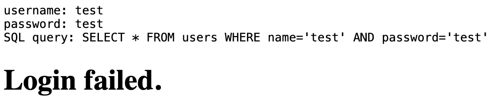
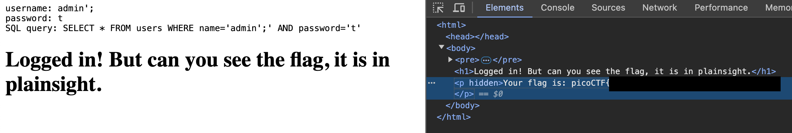

# SQLiLite
Liam Reidy

**Instructions:**

This challenge brings you to a webpage with a login. After submitting bogus information in the username and password, it brings us to an error page that shows the SQL query it is using to find the username and password.

Looks like it puts the input straight into the query. I don't know what username to use, so `admin` is a safe bet. As for the password, we don't even have to go that far. We can escape the query as long as the backend doesn't sanitize our input. Using `admin';` as the username, we escape the name parameter of the query with the `'`, and end the statement with `;`. This submitting this as the username and anything as the password, we get a web page that has the flag in it's source.

