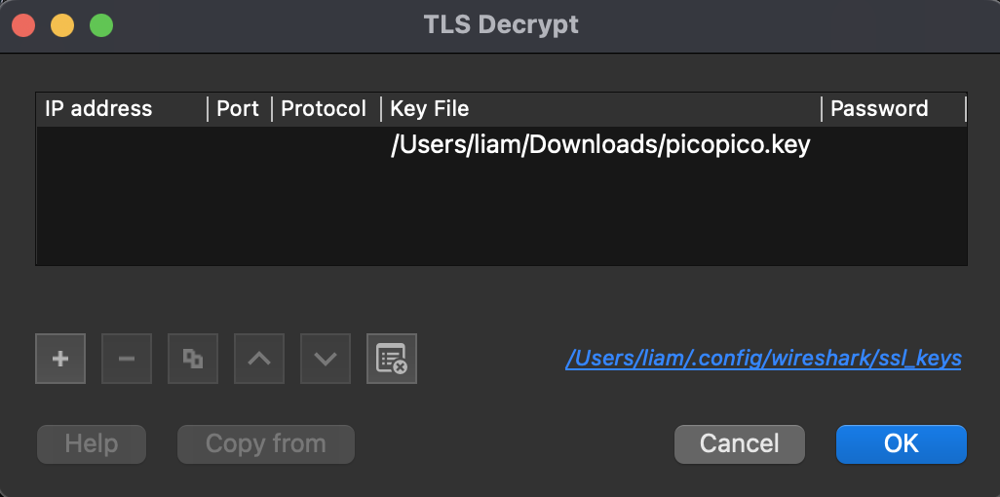
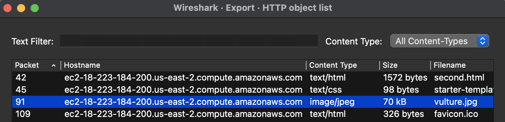

# WebNet1
Liam Reidy

**Instructions:** We found this packet capture and key. Recover the flag.

Opening the packet capture in Wireshark, we find 110 packets that are encrypted with TLS. Thankfully, we were given the TLS key. After recently completing the Fall 2024 Cyber Quest, I knew how to import TLS keys in Wireshark. Navigating to `Wireshark > Preferences > Protocols > TLS` I selected `Edit..` for the "RSA keys list", and added the supplied key:



After selecting `OK` and returning to the packet capture, multiple HTTP packets are revealed. Scrolling through, we see that an image is downloaded named `vultures.jpg`. To download the image (we can because the transfer of the data was complete) we navigate to `File > Export Objects > HTTP` and select the image to download. This is also when I realized that the `Export Objects` option is not dependent on which packet the user has selected, meaning I could have downloaded this image before scrolling through the packest!



The image is just a meme of two vultures with no visible flag, so I checked the metadata:

```bash
exiftool vulture.jpg
...
Artist : picoCTF{h...ts}
...
```

Sure enough, the "author" in the metadata is the flag. Here's the vulture meme if you're curious:

