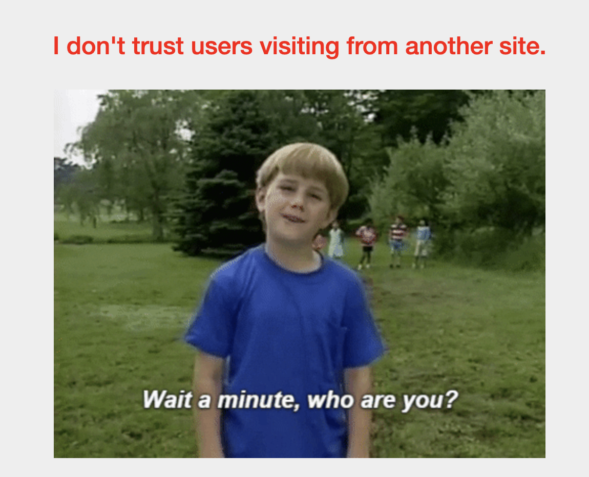
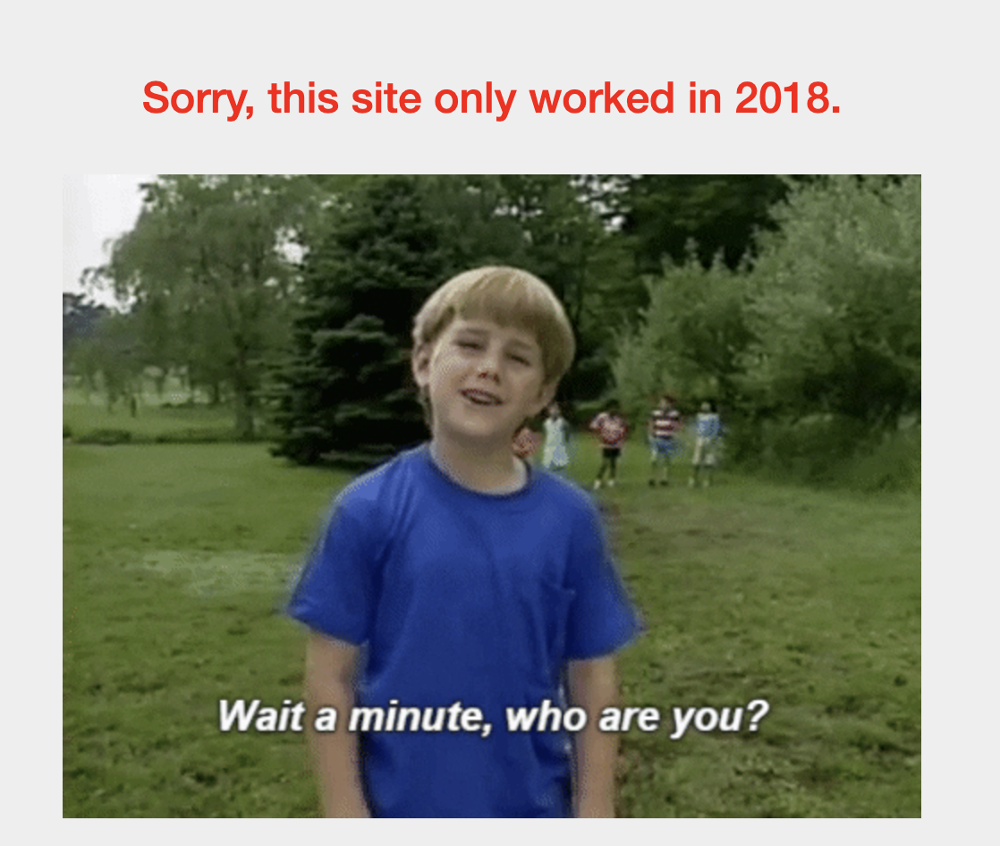
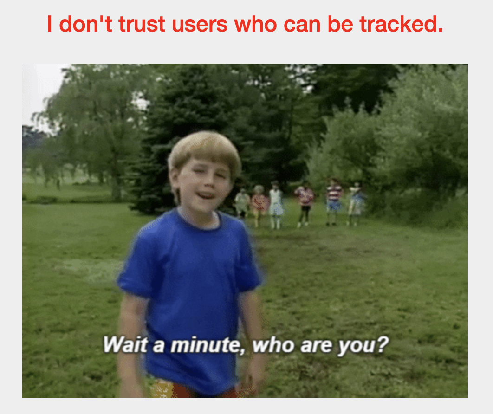
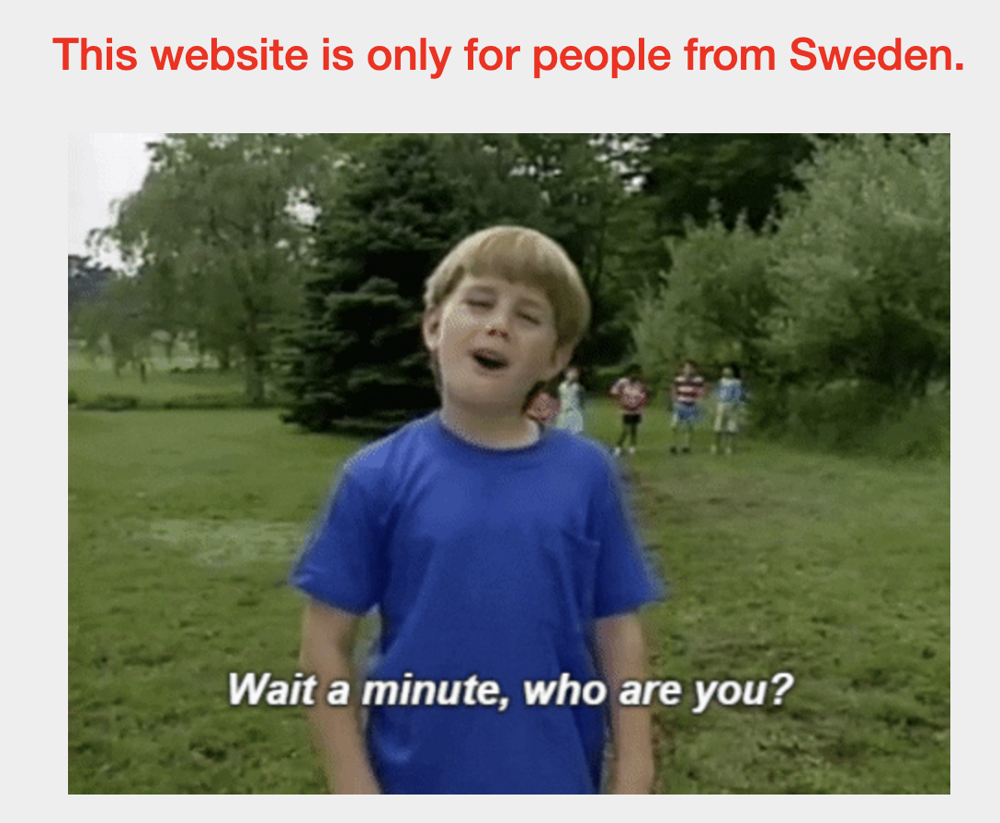
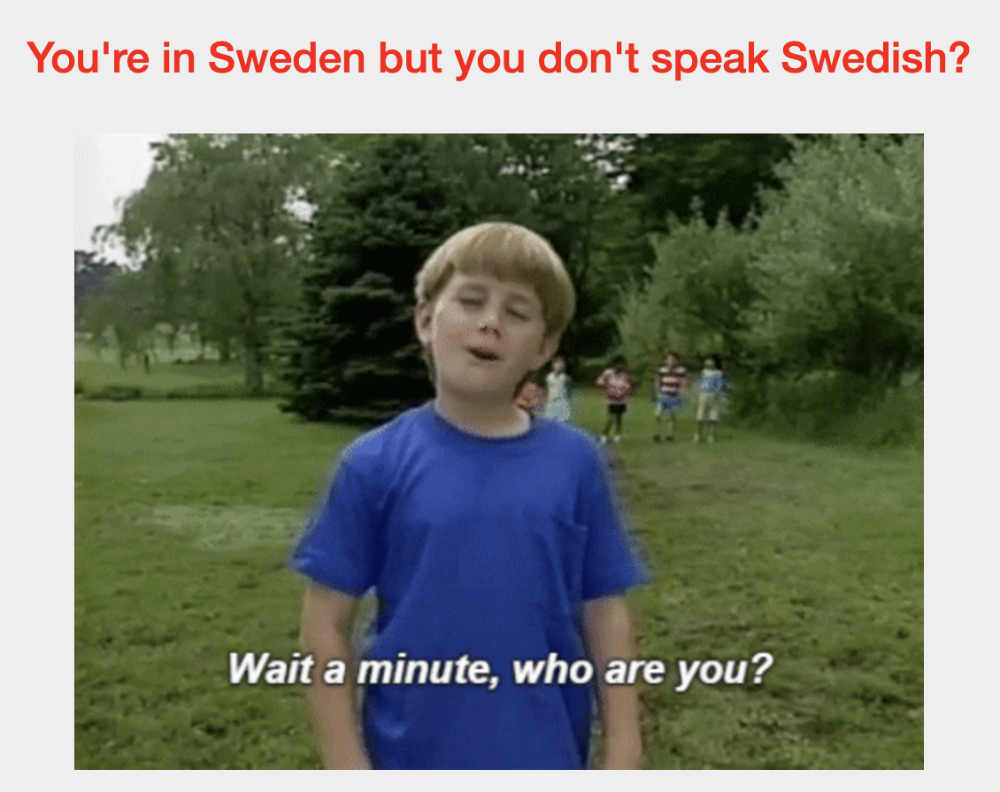

# Who are you?
Liam Reidy

**Instructions:** Let me in. Let me iiiiiiinnnnnnnnnnnnnnnnnnnn http://mercury.picoctf.net:36622/

This challenge reminds me of the picobrowser challenge based off this start. I swear I've done this challenge before...


Using Burp to change the user-agent: 

```http
...
Upgrade-Insecure-Requests: 1
User-Agent: PicoBrowser
Accept: 
...
```

Now we have a new message:



Is this in reference to a `Referer` field in the request? There isn't one in the request that is gnerated automatically, but I can try adding one:

```http
...
Referer: http://mercury.picoctf.net:36622
User-Agent: PicoBrowser
Accept: text/html,application/xhtml+xml,application/xml;q=0.9,
...
```

This took me longer than it should have, simply because I wasn't including the port number. Now apparently this site only works in 2018.



Shoutout to [Mozilla](https://developer.mozilla.org/en-US/docs/Web/HTTP/Headers/Date) for the information about the `Date` header whith which I was not already familiar.

```http
...
Date: Tue, 29 Oct 2018 16:56:32 GMT
Referer: http://mercury.picoctf.net:36622
User-Agent: PicoBrowser
...
```

Now it "Doesn't want users who can be tracked":




Once again using [Mozilla's site](https://developer.mozilla.org/en-US/docs/Web/HTTP/Headers/DNT) to browse possible fields I can add, I found "Do Not Track" (DNT):

```http
...
DNT: 1
Date: Tue, 29 Oct 2018 16:56:32 GMT
Referer: http://mercury.picoctf.net:36622
User-Agent: PicoBrowser
...
```

"This website is only for people from Sweden."



I could connect to a VPN from Sweden but surely that is not the answer. Maybe changing the accept-language to swedish?

```http
Accept-Language: sv 
```

That didn't work.

I couldn't find a title of another header that I thought would work for this, so I looked up "fields in http that change ip". That brought me to [wikipedia](https://en.wikipedia.org/wiki/List_of_HTTP_header_fields) which said:

| Name | Description |
| --- | --------- |
| X-Forwarded-For | A de facto standard for identifying the originating IP address of a client connecting to a web server through an HTTP proxy or load balancer. Superseded by Forwarded header. |

That sounds like it will work if I tell the site I am a proxy for an IP in Sweden. Going back to [Mozilla's site](./https://developer.mozilla.org/en-US/docs/Web/HTTP/Headers/X-Forwarded-For), we see how to use this header:

```http
X-Forwarded-For: 203.0.113.195
```

Placing this into our request using a [ip range](https://lite.ip2location.com/sweden-ip-address-ranges?lang=en_US) to find a Swedish IP:

```http
X-Forwarded-For: 102.177.146.0
DNT: 1
Date: Tue, 29 Oct 2018 16:56:32 GMT
Referer: http://mercury.picoctf.net:36622
User-Agent: PicoBrowser
...
```

Now the site wants me to speak Swedish! 



We already figured out how to change the accept language:
```http
...
Accept-Language: sv 
X-Forwarded-For: 102.177.146.0
DNT: 1
Date: Tue, 29 Oct 2018 16:56:32 GMT
Referer: http://mercury.picoctf.net:36622
User-Agent: PicoBrowser
...
```

"What can I say except, you are welcome"

The flag is ours!

Here is the final `GET` request:

```http
GET / HTTP/1.1
Host: mercury.picoctf.net:36622
Cache-Control: max-age=0
Accept-Language: sv 
X-Forwarded-For: 102.177.146.0
DNT: 1
Date: Tue, 29 Oct 2018 16:56:32 GMT
Referer: http://mercury.picoctf.net:36622
User-Agent: PicoBrowser
Accept: text/html,application/xhtml+xml,application/xml;q=0.9,image/avif,image/webp,image/apng,*/*;q=0.8,application/signed-exchange;v=b3;q=0.7
Accept-Encoding: gzip, deflate, br
Connection: keep-alive


```
