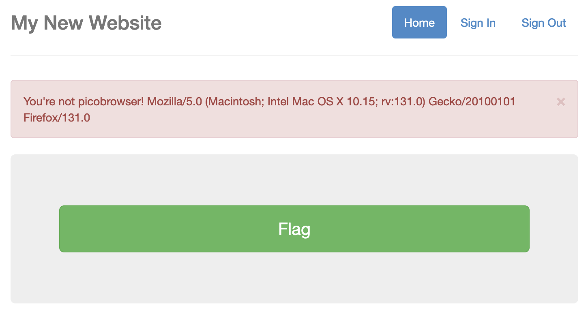
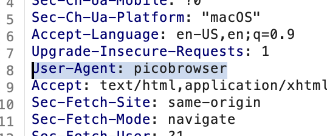
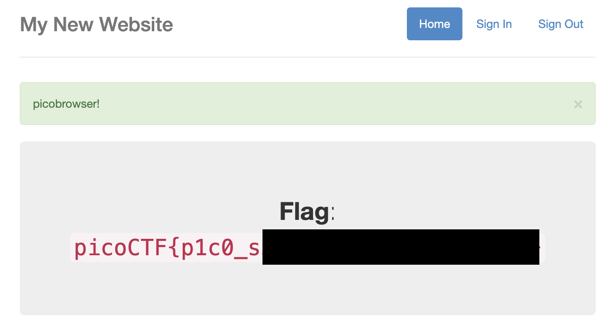

# picobrowser
Liam Reidy

**Instructions:** This website can be rendered only by picobrowser, go and catch the flag! https://jupiter.challenges.picoctf.org/problem/28921/ (link) or http://jupiter.challenges.picoctf.org:28921

This challenge was quite simple. The website has a big flag button. Selecting it gives an error that you are not using the "picobrowser"

The data displayed after it simply the `User-Agent` section of an HTTP request. I opened `Burp Suite` and the used the Interception mode to change that part of the header to "picobrowser".

There were a couple headers I had to edit, but once they were all changed to `picobrowser`, it displayed the flag.

